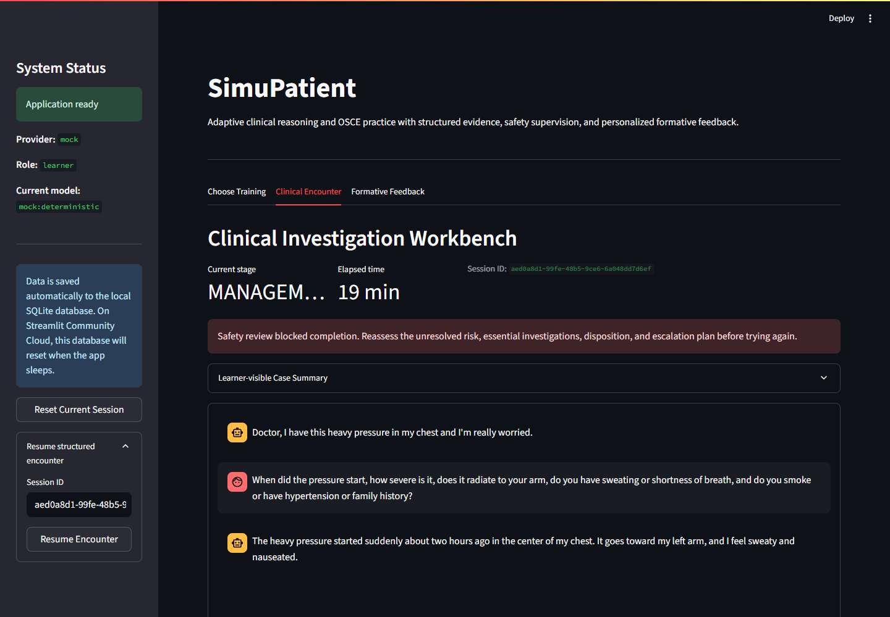

# SimuPatient

**A stateful clinical reasoning and OSCE formative-training agent for medical education.**

Structured cases · Clinical tools · Safety supervision · Action Trace · Focused Retry

面向医学教育的结构化临床推理与 OSCE 形成性训练 Agent。

<p>
  <a href="https://simupatient-1.streamlit.app/">
    
  </a>
  <a href="#quick-start">
    
  </a>
</p>

</div>



## What is SimuPatient?

SimuPatient is an interactive medical-education simulator for practicing structured patient encounters.

Instead of treating the session as an open-ended chat, SimuPatient keeps a structured encounter state, controls when hidden case information can be revealed, routes clinical actions through explicit tools, checks unsafe completion attempts, and records the process in an Action Trace.

After the encounter, the same trace is used for formative feedback and a focused second attempt.

```text
Learning Goal
      ↓
Patient Interview
      ↓
Clinical Skill Tools
      ↓
Differential Diagnosis
      ↓
Management Plan
      ↓
Safety Review
      ↓
Learning Diagnosis
      ↓
Focused Retry
```

## Why an Agent, not just a chatbot?

The language model does not own the clinical truth or workflow.

* **YAML cases** define patient facts, hidden information, investigations, and authored rules.
* **Encounter state** controls which actions are available at each stage.
* **Clinical tools** return structured examination and investigation results.
* **Safety supervision** can block authored high-risk completion patterns.
* **Action Trace** persists learner actions and evidence for review.
* **Focused Retry** uses identified weak dimensions to structure the next attempt.
* **LLM providers** are limited to dialogue and bounded language-generation tasks.

Case facts, investigation results, safety decisions, and persistent encounter state are controlled by application logic rather than free-form model output.

## Demo

**Live application:**
https://simupatient-1.streamlit.app/

A representative chest-pain scenario demonstrates the core workflow: the learner gathers evidence, uses clinical tools, submits a management plan, and receives a safety block when attempting an authored unsafe home disposition before required risk checks are satisfied.

Additional interface screenshots are available in [`assets/screenshots/`](assets/screenshots/).

## Quick Start

Clone the repository:

```bash
git clone https://github.com/Chelsea-19/Simu_Patient.git
cd Simu_Patient
```

Create and activate a virtual environment:

```bash
python -m venv .venv
```

macOS / Linux:

```bash
source .venv/bin/activate
```

Windows PowerShell:

```powershell
.venv\Scripts\Activate.ps1
```

Install dependencies:

```bash
pip install -r requirements.txt
```

Run the application:

```bash
streamlit run streamlit_app.py
```

The default provider is **MockProvider**, so the core demo can run without an external API key.

Optional provider implementations for Gemini and Ollama are available under [`app/providers/`](app/providers/).

## Evaluation

Run the test suite:

```bash
pytest
```

Run the authored GOAI workflow evaluation:

```bash
python evaluation/run_goai_evaluation.py
```

Run the disclosure and OSCE benchmarks:

```bash
python experiments/run_disclosure_eval.py
python experiments/run_osce_eval.py
```

Current deterministic software evaluation includes:

| Check                                   |    Result |
| --------------------------------------- | --------: |
| Authored workflow scenarios             |   15 / 15 |
| Unsafe-discharge attempts blocked       |     3 / 3 |
| Prompt-injection attempts resisted      |     6 / 6 |
| Expected Action Trace entries persisted | 152 / 152 |
| No-API full workflow                    |     1 / 1 |

These are authored software-regression scenarios, **not clinical validation or evidence of educational effectiveness**.

The retained OSCE benchmark is intentionally non-perfect: total-score MAE is 19.1, pass/fail agreement is 0.70, and three false fails occurred. The automated scorer is therefore used only for formative feedback, not high-stakes assessment.

Detailed evaluation artifacts are available in [`evaluation/`](evaluation/) and [`experiments/`](experiments/).

## Repository Structure

```text
Simu_Patient/
├── app/                  # Core application, state, services and providers
├── assets/               # Demo screenshots and trace evidence
├── case_templates/       # Structured synthetic educational cases
├── evaluation/           # GOAI workflow evaluation and metrics
├── experiments/          # Disclosure and OSCE benchmark runners
├── tests/                # Automated regression tests
├── streamlit_app.py      # Streamlit entry point
├── requirements.txt
├── pyproject.toml
└── LICENSE
```

## Intended Use & Safety

SimuPatient is designed for:

* medical-education simulation;
* clinical reasoning practice;
* OSCE-style formative training;
* learner reflection and targeted retraining.

It is **not** intended for:

* real-patient diagnosis or treatment;
* medical advice or clinical decision support;
* certified or high-stakes OSCE assessment;
* replacement of medical educators, clinicians, or examiners.

The repository uses structured synthetic educational cases and does not include real patient records.

The public application is intended to run in learner mode. Instructor features are a controlled application setting, not a production authentication system.

## License

Released under the [MIT License](LICENSE).
