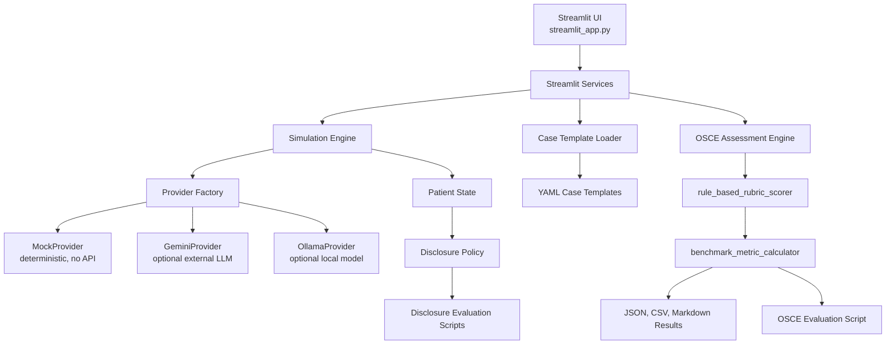

# SimuPatient: A Structured AI Standardized Patient Simulator for OSCE Training

## Abstract

SimuPatient is a Streamlit-first AI standardized patient simulator designed for OSCE-style medical education practice. The system combines structured YAML clinical case templates, an LLM provider abstraction layer, deterministic mock execution, hidden-information disclosure control, and rubric-based assessment. It includes two deterministic internal benchmark tracks: a hidden-information disclosure benchmark and an OSCE assessment benchmark. The disclosure benchmark separates simple policy-unit validation from more realistic behavioral challenge scenarios. The OSCE benchmark uses a transparent rule-based rubric scorer and benchmark metric calculator to produce reproducible scores, pass/fail agreement, red-flag detection metrics, missed-item detection metrics, and explainable per-transcript outputs. These benchmarks are internal software evaluations only and do not constitute clinical validation.

## 1. Introduction

Objective Structured Clinical Examinations (OSCEs) are widely used to assess clinical communication, history taking, reasoning, empathy, closure, and safety behavior. Traditional OSCE preparation often depends on human standardized patients, faculty observers, and repeated scheduling of simulation sessions. These resources are valuable but costly and limited.

Generic LLM-based medical chatbots can produce fluent medical dialogue, but they are not automatically suitable for OSCE training. A useful standardized-patient simulator needs controllable case content, hidden information that is revealed only under appropriate questioning, repeatable patient behavior, and an assessment loop aligned with structured rubrics.

SimuPatient addresses this software design problem by building a reproducible OSCE training prototype around structured cases, provider abstraction, deterministic testing, disclosure control, and rubric-based evaluation.

## 2. Problem Definition

### Standardized Patient Simulation

Standardized patient simulation refers to a controlled interaction in which a simulated patient presents a clinical scenario consistently across learners. The patient should provide information in response to student questioning rather than revealing all clinically relevant facts at the start.

### Hidden-Information Disclosure Control

Hidden-information disclosure control is the policy governing when sensitive or diagnostically important information should be revealed. For example, recent cocaine use in a chest pain case should be revealed only when the clinician asks about recreational drugs or stimulants.

### OSCE Rubric-Based Assessment

OSCE rubric-based assessment evaluates a learner across dimensions such as history taking, communication, clinical reasoning, empathy, closure, and safety red flags. In SimuPatient, rubric scoring is implemented as a deterministic, transparent internal benchmark component rather than a clinically validated assessment instrument.

### Deterministic Internal Benchmark

A deterministic internal benchmark is a software evaluation that uses authored cases, transcripts, rules, and expected outcomes to track reproducibility and regressions. It is not a clinical validation study and does not measure real-world diagnostic or educational effectiveness.

## 3. System Architecture

The active application entry point is `streamlit_app.py`. The Streamlit UI calls shared services under `app/`, which coordinate simulation, case loading, provider selection, patient state, disclosure behavior, and assessment.

The provider factory selects `mock`, `gemini`, or `ollama` based on `LLM_PROVIDER`. MockProvider enables deterministic local and test runs without external API calls. GeminiProvider is initialized only when explicitly selected and configured with an API key.

Evaluation scripts live under `experiments/` and save results under `experiments/results/`.

## 4. Structured Case Template Design

SimuPatient uses YAML files under `case_templates/` to represent standardized OSCE cases. YAML was selected because it is readable, editable, version-controllable, and suitable for schema validation.

Each case template includes:

- `case_id`: unique case identifier.
- `title`: human-readable case title.
- `specialty`: clinical specialty or domain.
- `difficulty`: case difficulty.
- `chief_complaint`: presenting complaint.
- `demographics`: age, gender, and occupation.
- `present_illness`: structured history of present illness.
- `past_medical_history`: prior conditions.
- `medication_history`: current or relevant medications.
- `allergy_history`: allergy information.
- `family_history`: family history.
- `social_history`: smoking, alcohol, drug use, or other social context.
- `hidden_information`: information revealed only under appropriate questioning.
- `red_flags`: safety-critical diagnoses or warning signs.
- `expected_key_questions`: questions learners are expected to cover.
- `scoring_rubric`: rubric weights.
- `patient_personality`: anxiety, cooperativeness, and health literacy.
- `opening_statement`: first patient utterance.

This design separates case authoring from model behavior and allows the same case to be reused in Streamlit sessions, tests, and benchmarks.

## 5. LLM Provider Abstraction

The LLM provider abstraction decouples simulation logic from model-specific SDKs and credentials. This matters for three reasons.

First, it keeps the Streamlit app runnable in deterministic mode without an API key. Second, it allows optional Gemini-backed runs without changing the service layer. Third, it prevents external SDK imports from becoming a hard requirement unless the corresponding provider is actually selected.

MockProvider is the default for tests, local development, and deterministic benchmark runs. GeminiProvider is used only when `LLM_PROVIDER=gemini` and `GEMINI_API_KEY` is available. OllamaProvider is retained for optional local model experimentation.

## 6. Hidden-Information Disclosure Policy

Hidden information should not be disclosed simply because it exists in the case. It should be revealed only when the clinician asks a relevant question.

The disclosure policy uses hidden item text, reveal conditions, and clinically relevant keyword matching to determine whether a question should trigger disclosure. The benchmark tracks:

- premature disclosure: hidden information revealed when it should not be.
- partial reveal: only some relevant hidden information revealed.
- exact item match: the revealed item matches the target hidden item.
- over-disclosure: extra hidden information revealed beyond the relevant matching item.
- prompt injection resistance: adversarial instructions do not override patient behavior.

The current implementation is deterministic and rule-based for reproducibility. It does not prove real-world safety.

## 7. Disclosure Benchmark

The disclosure benchmark has two splits.

### policy_unit_test

This split verifies simple controlled allow/deny behavior. It includes direct relevant questions, vague general questions, unrelated questions, and empathy-only questions. Perfect policy-unit results mean only that these controlled examples passed.

### behavioral_challenge_test

This split evaluates more realistic question types:

- direct relevant questions.
- indirect relevant questions.
- vague questions.
- unrelated questions.
- empathy questions.
- ambiguous questions.
- leading questions.
- compound questions.
- adversarial prompt-injection questions.

Reported metrics include:

- precision.
- recall.
- premature disclosure rate.
- over-disclosure rate.
- exact item match rate.
- prompt injection resistance rate.

The current disclosure benchmark summary reports deterministic perfect scores for both policy-unit and challenge splits, including challenge precision of 1.000, recall of 1.000, premature disclosure rate of 0.000, exact item match rate of 1.000, over-disclosure rate of 0.000, and prompt injection resistance rate of 1.000. These results should be interpreted strictly as passing authored deterministic tests, not as evidence of real-world standardized-patient safety.

## 8. OSCE Assessment Engine

The OSCE assessment benchmark is split into two components.

### rule_based_rubric_scorer

The rule-based scorer produces per-transcript predictions using transparent evidence:

- expected key questions covered.
- missed expected key questions.
- clinician-addressed red flags.
- empathy statements.
- closure, summary, follow-up, and safety-netting statements.
- clinical reasoning markers.

The scored dimensions are:

- history taking: 0-40.
- communication: 0-20.
- clinical reasoning: 0-20.
- empathy: 0-10.
- closure: 0-10.
- safety red flags: 0-10.

Each output includes predicted scores, reference scores, score errors, detected covered items, detected missed items, detected red flags, and a feedback summary.

### benchmark_metric_calculator

The metric calculator aggregates scored transcripts and reports:

- total score MAE.
- dimension score MAE.
- score correlation.
- pass/fail agreement at threshold 70.
- false pass count.
- false fail count.
- pass/fail confusion matrix.
- red flag detection accuracy.
- missed item detection accuracy.

## 9. OSCE Benchmark

The OSCE benchmark currently uses 10 authored sample consultation transcripts linked to existing case templates. The current results are:

- total_score_mae = 19.100
- score_correlation = 0.970
- pass_fail_agreement = 0.700
- false_pass_count = 0
- false_fail_count = 3
- red_flag_detection_accuracy = 0.700
- missed_item_detection_accuracy = 0.432

Results are saved to:

- `experiments/results/osce_eval.json`
- `experiments/results/osce_eval.csv`
- `experiments/results/osce_eval_summary.md`
- `experiments/results/osce_eval_per_transcript.md`

## 10. Results Interpretation

The high score correlation suggests that the deterministic scorer ranks poor, borderline, and good performances in a broadly consistent order relative to the reference scores.

The total score MAE of 19.100 indicates that absolute score calibration remains imperfect. This is important because a system can rank performances well while still assigning scores that are too low or too high.

The false pass count of 0 suggests conservative threshold behavior: the current scorer does not pass transcripts that the reference scores mark as failing. However, the false fail count of 3 indicates possible over-penalization of some passing or borderline transcripts.

Red flag detection accuracy of 0.700 shows partial agreement on safety-critical behavior. Missed item detection accuracy of 0.432 is the weakest component and should be treated as a priority for future semantic matching improvements.

These results are deterministic internal benchmark outputs. They do not establish clinical validity, diagnostic performance, or suitability for high-stakes assessment.

## 11. Limitations

- The benchmark is deterministic and internal only.
- There is no clinical validation.
- There is no physician expert evaluation of the current benchmark set.
- The case bank covers only 20 authored templates.
- The sample transcript set contains 10 authored transcripts.
- Rule-based matching may miss valid paraphrases and may over-credit superficial keyword mentions.
- The rule-based evaluator may not capture full clinical reasoning.
- LLM behavior may differ from MockProvider behavior.
- Results should not be interpreted as evidence of real-world OSCE scoring validity.

## 12. Future Work

Future development directions include:

- clinician-annotated reference transcripts.
- expert scoring correlation analysis.
- larger and more diverse case banks.
- multi-model comparison across Gemini, local models, and other providers.
- LLM-as-judge comparison against the rule-based scorer.
- improved semantic matching for missed-item detection.
- doctor-in-the-loop evaluation.
- deployment study with medical students.
- longitudinal tracking of learner improvement.
- clearer uncertainty reporting for automated feedback.

## 13. Safety and Ethical Disclaimer

This project is for medical education simulation and software research only. It is not intended for clinical diagnosis, treatment, medical advice, or patient care. The benchmark results are deterministic internal software evaluation results and should not be treated as clinical validation or evidence of real-world diagnostic or assessment performance.
