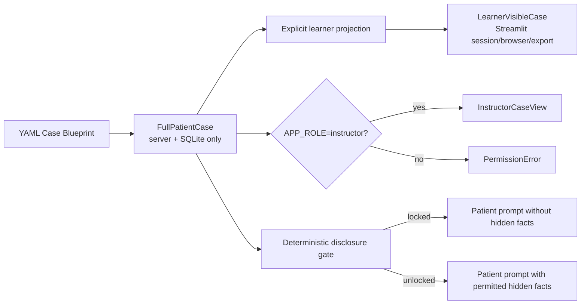

# SimuPatient State Separation

实施阶段：Phase 1
安全默认值：`APP_ROLE=learner`

## Purpose

本设计保证学生端在问诊前无法获得病例答案。安全边界不依赖“前端不显示”或“提示模型不要泄露”，而由显式 schema、服务层投影、角色门禁和患者 prompt 最小化共同执行。

完整病例仍保存在服务端 SQLite，供患者模拟、形成性评估和教师审阅使用；浏览器和 learner `st.session_state` 只接收 `LearnerVisibleCase`。

## Trust Boundary



## View Models

### FullPatientCase

Server-side wrapper for the persisted source of truth:

- `patient_id`；
- full `profile` dictionary；
- `opening_statement`。

It may contain instructor-only facts and must never be stored in learner session state or returned by normal exports.

### LearnerVisibleCase

This is an explicit allowlist model with Pydantic `extra="forbid"`:

- `patient_id`；
- `case_id`；
- `age`；
- `gender`；
- `encounter_setting`；
- `chief_complaint`；
- `opening_statement`；
- `unlocked_evidence`。

The model intentionally has no generic `profile` or `metadata` field, preventing future full-case fields from silently crossing the boundary.

### InstructorCaseView

Available only after a server-side `APP_ROLE=instructor` check:

- `full_case`；
- `rubric`；
- `learner_action_trace`；
- `unlock_history`；
- `scoring_evidence`。

Phase 1 builds the action trace compatibility view from existing consultation rows. A dedicated append-only Action Trace model will be introduced with the clinical tool state machine in Phase 2.

### UnlockedEvidence

Typed learner-visible evidence contract:

- evidence ID；
- category；
- learner-facing label/value；
- unlock timestamp；
- source action。

Phase 1 initializes this list as empty. Phase 2 tools will populate it only after deterministic unlock rules succeed.

## Forbidden Learner Fields

The following fields are centrally listed in `LEARNER_FORBIDDEN_FIELDS` and absent from the learner schema:

```text
hidden_info
hidden_information
red_flags
expected_key_questions
scoring_rubric
ground_truth_diagnosis
unreleased_test_results
```

The learner schema rejects any payload containing one of these fields instead of silently ignoring it.

## Data Flow

### Learner creation flow

1. `SimuEngine` creates the full case and persists `full_profile_json` in SQLite.
2. `app/streamlit_services.py` immediately calls `project_learner_case()`.
3. The creation response contains only `id`, `case: LearnerVisibleCase`, and the safe opening statement.
4. Streamlit stores only `patient_id`, `learner_case`, chat messages and learner assessment state.
5. The learner UI renders the allowlisted fields individually; it never calls `st.json()` on a case profile.

### Normal export flow

`export_learner_case_logic()` reloads the server record and rebuilds `LearnerVisibleCase`. It does not serialize or filter a full profile at the UI layer. This makes the normal JSON download safe even if new instructor fields are later added to YAML.

### Instructor flow

1. Server operator explicitly sets `APP_ROLE=instructor`.
2. Streamlit adds an `Instructor Case View` tab.
3. `get_instructor_case_view_logic()` checks the cached server setting again.
4. Only after the check does the service read `full_profile_json`, consultation snapshots and assessments.
5. The full payload is rendered only in the instructor deployment/session.

`APP_ROLE` is a deployment-level switch, not user authentication. A learner-facing deployment must never be started in instructor mode.

### Patient Agent disclosure flow

The runtime uses the same deterministic matching rules as the disclosure benchmark:

1. the state analyzer may suggest emotional state changes；
2. Python independently computes matching hidden items from the latest learner question；
3. prompt-injection, vague and unrelated questions do not open the gate；
4. the provider's `should_reveal_hidden` value is overwritten by the deterministic decision；
5. before unlock, hidden facts are removed from the Patient Agent system prompt；
6. after a direct or semantically matching question, only then are hidden facts supplied to the patient prompt；
7. red flags, expected questions, rubric and ground-truth/test-answer fields never enter the Patient Agent answer prompt.

Provider-generated internal monologue is not forwarded into the patient answer prompt, because it could echo hidden state.

## Session and Reset Behavior

Learner `st.session_state` contains:

```text
patient_id
learner_case
chat_history
assessment
```

It no longer contains `patient_profile`. Reset clears all four learner values. Starting another case creates a new patient ID and a new learner projection; server-side hidden state remains keyed to its original patient ID and is not reused.

## Logging and Error Handling

Ordinary logs record identifiers, provider names, latency and scores but not full profiles. JSON parse failures no longer log the raw model response. The public exception message also suppresses raw output, preventing `st.error(str(exception))` from echoing hidden content.

The raw parse value remains an internal exception attribute for controlled debugging and is not included in the ordinary message or log record.

## Role Configuration

Learner deployment:

```powershell
$env:APP_ROLE = "learner"
$env:LLM_PROVIDER = "mock"
streamlit run streamlit_app.py
```

Controlled instructor deployment:

```powershell
$env:APP_ROLE = "instructor"
$env:LLM_PROVIDER = "mock"
streamlit run streamlit_app.py
```

Invalid role values fail settings validation. `.env.example` and `.streamlit/secrets.toml.example` both document the learner default.

## Verification

`tests/test_learner_state_isolation.py` verifies:

- learner schema rejects every forbidden field；
- chest-pain learner response contains no hidden facts, expected questions or rubric；
- normal learner export is safe；
- learner role cannot call instructor service；
- instructor role can read full case, rubric, trace, unlock history and scoring evidence；
- unrelated questions do not unlock hidden facts；
- direct recreational-drug/stimulant questions do unlock the cocaine item；
- learner Streamlit state contains only the allowlist and renders no case JSON；
- reset clears learner state and a new case receives a new patient ID；
- all 20 existing YAML cases project to the same safe contract；
- instructor Streamlit mode renders the controlled review tab；
- raw parse errors do not expose hidden text through messages or logs；
- the Patient Agent prompt cannot see hidden facts before deterministic unlock。

The original disclosure benchmark remains a separate regression suite and must continue to report its Phase 0 baseline.

## Known Limitations

- `APP_ROLE` is deployment-wide and does not replace authentication, authorization or per-user teacher accounts.
- SQLite contains the full case by design and must be protected as server-side data.
- Phase 1 has a compatibility action trace derived from chat turns; clinical tool actions do not exist yet.
- Unlock state is currently a case-level boolean plus revealed item snapshots. Phase 2 should persist item-level `UnlockedEvidence` events.
- Assessment feedback is shown after encounter completion and remains formative, not a validated examination score.
