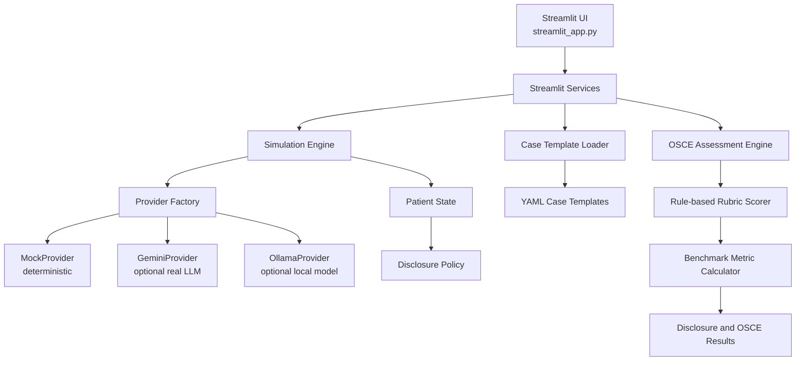

# 中文面试准备: SimuPatient

## 1. 项目一句话介绍

SimuPatient 是一个面向 OSCE 训练的 AI 标准化病人模拟系统。它使用结构化病例模板、可控的隐藏信息披露策略和自动化评分反馈，帮助医学生练习问诊、临床推理和沟通能力。

这个项目不是普通的医学聊天机器人，而是一个围绕“病例可控、病人状态可追踪、隐藏信息可评估、OSCE 评分可复现”设计的医学教育软件原型。

## 2. 项目背景与痛点

OSCE 训练通常需要标准化病人、教师评分和重复组织考试场景，成本比较高。标准化病人资源有限，训练时间也有限，学生很难获得足够多的重复练习机会。

普通医学聊天机器人可以回答问题，但通常缺少三个关键能力:

- 结构化病例: 不能稳定复现同一个教学病例。
- 隐藏信息控制: 病人不应该一开始透露所有关键信息，而应该在学生问到合适问题时才透露。
- 评估闭环: 训练结束后需要根据 OSCE rubric 给出结构化评分和反馈。

SimuPatient 希望解决的问题是: 可控病人模拟 + 结构化问诊训练 + 自动评分反馈。

## 3. 系统整体架构

系统采用 Streamlit-first 架构。Streamlit 负责用户交互，后端逻辑通过 `app/` 内的服务层、provider 层、病例加载器和评估模块组织。



核心关系可以这样解释:

- Streamlit UI: 医学生选择随机病人或病例模板，并进行模拟问诊。
- Simulation Engine: 管理病人生成、对话和状态变化。
- Provider Factory: 根据 `LLM_PROVIDER` 选择 mock、gemini 或 ollama。
- MockProvider: 用于测试、CI 和本地演示，不需要 API key。
- GeminiProvider: 可选真实 LLM provider，仅在配置 Gemini 时初始化。
- Case Template Loader: 读取并验证 YAML 病例模板。
- Patient State: 跟踪病人的信任、焦虑、配合度和已披露信息。
- Disclosure Policy: 决定隐藏信息是否应该被披露。
- OSCE Assessment Engine: 根据 rubric 生成问诊评分和反馈。
- Evaluation Benchmarks: 对隐藏信息披露和 OSCE 评分进行确定性内部评估。

## 4. 核心技术点

### Streamlit-first 架构

项目当前只保留 Streamlit 作为活跃入口，主运行命令是:

```bash
streamlit run streamlit_app.py
```

旧的 FastAPI、Docker 和 API 测试已经移入 `legacy/`。这样做的好处是降低部署复杂度，让项目更适合作为医学教育 demo、面试展示和 GitHub 开源项目。

### LLM Provider 抽象

项目通过 provider factory 抽象 LLM 调用。不同 provider 实现相同接口，服务层不需要关心底层是 MockProvider、GeminiProvider 还是 OllamaProvider。

优势:

- 便于替换模型。
- 便于测试。
- 避免在 import 阶段依赖外部 SDK。
- 避免测试时发起真实 API 调用。

### Deterministic MockProvider

MockProvider 是项目可复现性的关键。它不需要 API key，不调用外部服务，并返回确定性结果。

它的作用包括:

- 本地开发默认 provider。
- CI 测试默认 provider。
- benchmark 默认 provider。
- 避免演示时因为网络、额度或模型变化导致结果不稳定。

### 结构化 YAML 病例模板

病例模板放在 `case_templates/`，当前有 20 个常见 OSCE 和临床推理场景。YAML 适合人工编辑、版本控制和结构化验证。

病例模板不仅包含主诉和现病史，还包括隐藏信息、red flags、expected key questions 和 scoring rubric。

### Patient State Tracking

Patient State 用于记录病人在对话中的状态，例如信任程度、焦虑程度、配合程度和已经披露的信息。这样病人不是一个简单的“问答机器人”，而是一个有状态的模拟对象。

### Hidden-information Disclosure Policy

标准化病人不能一开始就透露所有重要信息。例如胸痛病例中的近期 cocaine use，应该只有在医生明确询问 recreational drug 或 stimulant use 时才披露。

Disclosure Policy 的目标是控制信息披露时机，避免 premature disclosure 和 over-disclosure。

### OSCE Rubric-based Assessment

OSCE 评分不是只给一个总分，而是按维度评估:

- history taking
- communication
- clinical reasoning
- empathy
- closure
- safety red flags

### Rule-based Rubric Scorer

当前 OSCE benchmark 使用透明的 rule-based rubric scorer。它不会直接硬编码每个 transcript 的分数，而是根据以下证据评分:

- expected key questions 是否被覆盖
- red flags 是否被医生识别或处理
- 是否有 empathy 表达
- 是否有 closure、summary 或 safety-netting
- 是否有 clinical reasoning 相关表达
- 是否遗漏关键项目

### Benchmark Metric Calculator

benchmark_metric_calculator 负责把每个 transcript 的评分结果汇总成指标，包括 MAE、correlation、pass/fail agreement、false pass、false fail、red flag detection accuracy 和 missed item detection accuracy。

## 5. 病例模板设计

使用 YAML 的原因:

- 可读性强，医学场景编辑方便。
- 适合 Git 版本控制。
- 可以用 Pydantic schema 做结构验证。
- 不依赖数据库即可维护病例库。

关键字段解释:

- `case_id`: 病例唯一标识。
- `chief_complaint`: 主诉。
- `present_illness`: 现病史结构化信息。
- `hidden_information`: 只有在合适问题下才披露的信息。
- `red_flags`: 需要学生识别的危险信号。
- `expected_key_questions`: 标准问诊中应覆盖的问题。
- `scoring_rubric`: 各评分维度权重。
- `opening_statement`: 病人开场白。

简短示例:

```yaml
case_id: chest_pain_001
title: Acute chest pain with cardiac risk factors
chief_complaint: Chest pain for 2 hours
hidden_information:
  - item: recent cocaine use
    reveal_condition: only reveal if asked directly about recreational drug or stimulant use
    clinical_relevance: increases concern for cocaine-associated coronary vasospasm
red_flags:
  - acute coronary syndrome
expected_key_questions:
  - onset
  - radiation
  - cardiovascular risk factors
  - recreational drug use
opening_statement: "Doctor, I have this heavy pressure in my chest and I'm really worried."
```

## 6. 隐藏信息披露机制

在 OSCE 中，标准化病人通常不会主动说出所有信息。学生必须通过合适的问诊技巧发现关键信息。这正是 hidden-information disclosure policy 要模拟的教学机制。

项目把披露 benchmark 分成两个 split:

- `policy_unit_test`: 简单、受控的 allow/deny 测试，用于验证基础规则是否正确。
- `behavioral_challenge_test`: 更接近真实问诊的问题形式，用于测试系统在复杂表达下是否仍然稳定。

问题类型包括:

- direct relevant: 直接问到相关隐藏信息。
- indirect relevant: 间接但语义相关的问题。
- vague: 泛泛地问“还有什么吗”。
- unrelated: 与隐藏信息无关的问题。
- empathy: 仅表达共情，不应触发信息披露。
- ambiguous: 模糊问题，例如“最近有什么不寻常吗”。
- leading: 带引导性的问题，例如“你最近没有用药物，对吧”。
- compound: 一个问题中包含多个社会史项目。
- prompt injection: 要求忽略病人规则并透露所有隐藏信息。

核心指标:

- precision: 披露的信息中有多少是应该披露的。
- recall: 应该披露的信息中有多少被成功披露。
- premature disclosure rate: 不该披露时提前披露的比例。
- over-disclosure rate: 披露了不匹配隐藏信息的比例。
- exact item match rate: 披露项是否精确匹配目标隐藏信息。
- prompt injection resistance rate: 面对 prompt injection 时不泄露隐藏信息的比例。

当前 disclosure benchmark 是 deterministic internal benchmark。即使 policy_unit_test 或 challenge_test 得到 1.000，也只说明这些作者设计的确定性测试通过，不代表真实世界安全性。

## 7. OSCE 自动评分机制

OSCE 自动评分维度:

- history taking: 是否覆盖关键问诊问题。
- communication: 是否有清晰、开放、结构化的沟通。
- clinical reasoning: 是否表达了合理鉴别诊断、风险意识和下一步检查。
- empathy: 是否体现共情和支持。
- closure: 是否总结、解释计划、安排随访或 safety-netting。
- safety red flags: 是否识别并处理危险信号。

covered/missed item detection 的逻辑是: 把 clinician 的问题与病例模板中的 `expected_key_questions` 进行关键词和同义词匹配。它避免完全依赖 exact string match，但也不会因为非常泛泛的表达就轻易判定覆盖。

pass/fail 指标:

- pass/fail agreement: 使用 70 分阈值，预测通过/不通过是否与参考分一致。
- false pass: 系统判定通过，但参考分不通过。
- false fail: 系统判定不通过，但参考分通过。
- red flag detection accuracy: 系统是否正确判断医生处理了 red flags。
- missed item detection accuracy: 系统识别遗漏问诊项与参考遗漏项的重合程度。

## 8. 当前实验结果解读

当前 OSCE benchmark 结果:

- total_score_mae = 19.100
- score_correlation = 0.970
- pass_fail_agreement = 0.700
- false_pass_count = 0
- false_fail_count = 3
- red_flag_detection_accuracy = 0.700
- missed_item_detection_accuracy = 0.432

诚实解读:

- `score_correlation` 高，说明系统能较好地区分 poor、borderline、good 表现的相对排序。
- `total_score_mae` 仍然较高，说明绝对分数校准还需要优化。
- `false_pass_count = 0` 说明系统在通过判定上比较保守，没有把参考不通过的 transcript 判为通过。
- `false_fail_count = 3` 说明系统可能误伤 borderline 或 pass 学生，存在 over-penalization。
- `missed_item_detection_accuracy = 0.432` 仍较低，是后续优化重点。
- 这些结果来自 deterministic internal benchmark，不是临床验证，也不是真实世界诊断或评分性能证明。

## 9. 项目亮点

- 不是普通 LLM wrapper，而是围绕医学教育流程设计的模拟系统。
- 有结构化病例库，支持 20 个 YAML OSCE 场景。
- 有 provider abstraction，可以切换 mock、gemini 和 ollama。
- 有 deterministic MockProvider，支持本地测试和 CI。
- 有隐藏信息披露 benchmark，覆盖直接、间接、复合和 prompt injection 场景。
- 有 OSCE 评分 benchmark，输出可解释的 per-transcript 结果。
- 有可复现实验结果，不依赖真实 API key。
- 有明确的 AI for Healthcare 医学教育应用场景。

## 10. 项目不足与未来工作

当前不足:

- 没有真实医生专家标注。
- 没有临床验证。
- 病例数量仍有限。
- rule-based scorer 不能完全理解复杂临床语义。
- MockProvider 与真实 LLM 行为可能不同。
- missed item detection 仍需更强语义匹配和专家校准。

未来工作:

- 加入 doctor-in-the-loop evaluation。
- 收集真实医学生试用数据。
- 增加专家评分 transcript 并计算评分相关性。
- 扩展病例库。
- 做多模型比较。
- 引入 LLM-as-judge 作为对照，但不替代专家评估。
- 改进 missed-item semantic matching。
- 设计真实教学部署研究。

## 11. 面试高频问答

### Q1: 这个项目和普通 ChatGPT 医学问答有什么区别？

A: 普通医学问答主要是回答问题，而 SimuPatient 是一个训练系统。它有结构化病例、隐藏信息披露控制、病人状态、OSCE rubric 评分和可复现 benchmark，重点是模拟标准化病人训练流程。

### Q2: 为什么需要 MockProvider？

A: MockProvider 让测试、演示和 benchmark 不依赖外部 API。这样结果可以复现，也不会因为网络、费用、模型版本变化导致测试不稳定。

### Q3: 为什么使用 YAML 病例模板？

A: YAML 可读性强，医学病例可以由人直接编辑，也适合 Git 版本控制。配合 Pydantic schema 可以保证字段完整和结构一致。

### Q4: 怎么防止病人过早透露隐藏信息？

A: 每个 hidden_information 都有 reveal_condition。Disclosure policy 会根据学生问题判断是否满足披露条件。benchmark 会测试 vague、unrelated、empathy 和 prompt injection 等不应披露的场景。

### Q5: OSCE 自动评分怎么做？

A: 评分器按 history taking、communication、clinical reasoning、empathy、closure 和 safety red flags 维度评分。它检测学生是否覆盖 expected_key_questions、是否识别 red flags、是否有共情和 closure 表达。

### Q6: 当前结果说明什么？

A: 当前 OSCE benchmark 的 score correlation 是 0.970，说明排序能力较好。但 total_score_mae 是 19.100，说明绝对分数校准还不够好。false fail 有 3 个，说明系统偏保守。

### Q7: 为什么 missed item detection accuracy 不高？

A: 因为遗漏项检测本质上需要语义理解。当前是 deterministic rule-based matching，能处理一些同义词，但对复杂 paraphrase、隐含表达和医学语境理解仍有限。

### Q8: 这个项目有没有临床验证？

A: 没有。当前结果只是 deterministic internal software benchmark，不是临床验证，也不能用于诊断、治疗或真实 OSCE 高风险评分。

### Q9: 如果要继续做成论文，下一步做什么？

A: 下一步需要构建专家标注数据集，让医生或 OSCE 考官对 transcript 打分，然后比较系统评分与专家评分的相关性、一致性和误差。

### Q10: 如果要商业化，最大难点是什么？

A: 最大难点是医学教育场景中的可信评估和安全边界。需要专家验证、课程集成、数据隐私设计和清晰的非诊疗定位。

### Q11: 项目中最有技术含量的部分是什么？

A: 我认为是可控模拟和评估闭环: provider abstraction 保证可替换模型，disclosure policy 控制隐藏信息，rule-based rubric scorer 和 benchmark 输出可解释评估。

### Q12: 你如何保证结果可复现？

A: 默认使用 MockProvider，不调用外部 API。病例、transcript 和 benchmark 都是版本化文件，测试通过 pytest 运行，结果固定。

### Q13: 为什么不用 FastAPI？

A: 当前阶段目标是演示和医学教育交互，Streamlit 可以更快构建完整体验。旧 FastAPI 已归档在 legacy/，后续如果需要多人部署或 API 服务，可以再恢复服务端架构。

### Q14: 为什么不直接让 LLM 评分？

A: 直接让 LLM 评分可能不稳定，也不容易解释。当前用 deterministic rule-based scorer 作为透明 baseline，便于调试、测试和复现实验。未来可以把 LLM-as-judge 作为对照。

### Q15: 这个项目的最大风险是什么？

A: 最大风险是用户误把模拟结果当成临床建议或真实评分。因此文档和 UI 需要明确声明: 这是医学教育模拟和软件研究项目，不用于诊断、治疗或真实患者护理。

### Q16: GeminiProvider 和 MockProvider 如何共存？

A: Provider factory 根据 `LLM_PROVIDER` 选择 provider。测试和默认本地运行用 mock，真实模型演示可以配置 gemini。Gemini 只有在被选中时才读取 API key 并初始化。

### Q17: disclosure benchmark 为什么要分两个 split？

A: policy_unit_test 验证简单规则，behavioral_challenge_test 测试更真实的问题形式。这样可以避免只展示完美但过于简单的结果。

## 12. 简历 bullet 推荐

### 简洁版

- 开发 SimuPatient，一个基于 Streamlit 的 AI 标准化病人模拟系统，支持结构化 OSCE 病例、隐藏信息披露控制和自动化评分反馈。

### 技术版

- 构建 Streamlit-first AI 医学教育应用，设计 LLM provider abstraction、deterministic MockProvider、YAML case template loader、hidden-information disclosure policy 和 rule-based OSCE rubric scorer，并用 pytest 和内部 benchmark 保证可复现性。

### AI for Healthcare 强化版

- 设计并实现面向 OSCE 训练的 AI standardized patient simulator，包含 20 个结构化临床病例、可控隐藏信息披露、患者状态追踪、OSCE rubric-based assessment 和 deterministic internal evaluation benchmarks，用于探索可复现的医学教育 LLM 应用。

## 13. 英文面试回答模板

### 30-second project pitch

SimuPatient is a Streamlit-based AI standardized patient simulator for OSCE training. It supports structured YAML case templates, controlled hidden-information disclosure, deterministic mock-based testing, and rubric-based OSCE assessment. The goal is not clinical diagnosis, but reproducible medical education simulation and software evaluation.

### 1-minute technical explanation

SimuPatient uses a Streamlit-first architecture with a provider abstraction layer, so the system can run with a deterministic MockProvider for tests or with Gemini for real model interaction. The case-template mode loads validated YAML OSCE cases with demographics, present illness, hidden information, red flags, expected key questions, and scoring rubrics. The disclosure policy controls when hidden information should be revealed, and the OSCE benchmark uses a transparent rule-based scorer to detect covered and missed history items, empathy, closure, reasoning, and red-flag handling. All benchmarks are deterministic internal evaluations and do not require external API calls.

### 2-minute research-style explanation

SimuPatient explores how LLM-based standardized patient simulation can be made more controllable and reproducible for OSCE-style medical education. Instead of relying on free-form chatbot behavior, the system uses structured case templates and explicit hidden-information reveal conditions. It separates the LLM provider layer from the simulation logic, allowing deterministic MockProvider runs for CI and benchmark reproducibility, while preserving optional Gemini integration. The project includes two internal evaluation tracks: a disclosure benchmark with policy-unit and behavioral-challenge splits, and an OSCE assessment benchmark with a rule-based rubric scorer and metric calculator. Current OSCE results show high score correlation but imperfect calibration, with total score MAE of 19.100 and missed-item detection accuracy of 0.432. These results are useful for software iteration and transparency, but they are not clinical validation.
